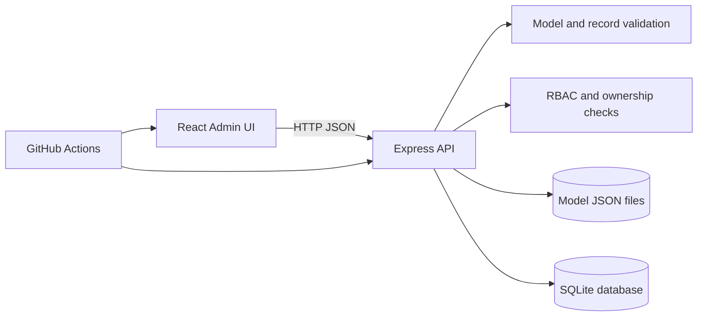
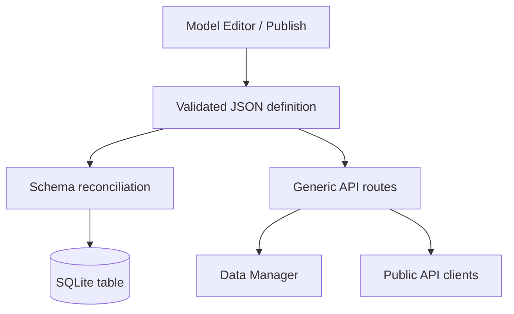
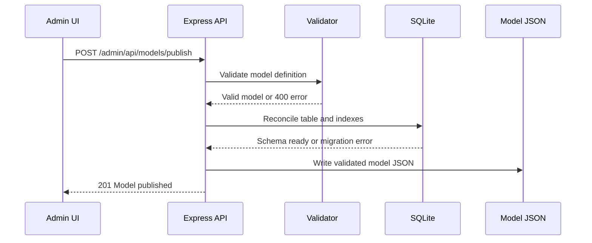
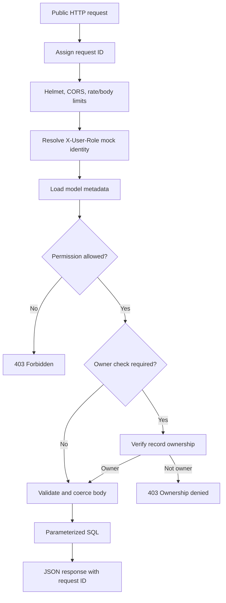
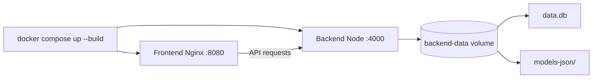

# SDE CRUD Platform

> A metadata-driven CRUD and role-based access-control platform that turns a
> model definition into a working database table, administrative data UI, and
> public API.

## Table of contents

- [Project objective](#project-objective)
- [What makes this project different](#what-makes-this-project-different)
- [Technology stack](#technology-stack)
- [Architecture at a glance](#architecture-at-a-glance)
- [Repository structure](#repository-structure)
- [Core concepts](#core-concepts)
- [Model definition](#model-definition)
- [End-to-end flows](#end-to-end-flows)
- [API reference](#api-reference)
- [Quick start](#quick-start)
- [Configuration](#configuration)
- [Testing and quality checks](#testing-and-quality-checks)
- [Security model and limitations](#security-model-and-limitations)
- [Data, schema, and deployment guidance](#data-schema-and-deployment-guidance)
- [Operational endpoints and observability](#operational-endpoints-and-observability)
- [Development workflow](#development-workflow)
- [Roadmap](#roadmap)
- [Important design decisions](#important-design-decisions)
- [Contributing](#contributing)

## Project objective

The SDE CRUD Platform is an extensible foundation for quickly creating
data-backed applications without writing a new controller, route, database
table, and form for every business entity.

Instead of hard-coding an `Employee` or `Product` feature, an administrator
defines a model containing:

- A model and table name
- Fields and supported types
- Required and unique constraints
- Optional ownership semantics
- Role-based permissions

The platform then:

1. Validates the definition.
2. Persists it as JSON metadata.
3. Reconciles a SQLite table and indexes.
4. Exposes generic administrative CRUD routes.
5. Exposes a public CRUD API protected by the model's RBAC rules.
6. Renders the model and its records in a reusable React interface.

This makes the repository both a working CRUD application and a reference
implementation for metadata-driven application design.

## What makes this project different

### 1. One definition drives the entire feature

A model is not merely a form configuration. The same definition drives
validation, SQL schema reconciliation, API behavior, ownership enforcement,
and frontend controls. This reduces drift between the database, backend, and
UI.

### 2. Runtime extensibility without a code deploy

Publishing a valid model creates a new resource through the generic platform.
The backend does not require a new JavaScript route file for every model.

### 3. Safety is built into dynamic behavior

Dynamic SQL identifiers are validated and quoted, values are parameterized,
records are validated against the model contract, and unsafe required-field
migrations are rejected rather than silently corrupting existing data.

### 4. Clear separation between administration and public access

The administrative API is designed for the model editor and data manager.
The public API applies model-defined permissions and, when configured, limits
updates and deletes to the record owner.

### 5. A deliberately honest production boundary

The project includes health checks, structured request IDs, rate limiting,
security headers, Docker assets, CI, and an operations runbook. It still
uses SQLite and a mock header-based identity system, so it is production-ready
as a single-instance foundation, not as a horizontally scaled enterprise
deployment.

## Technology stack

| Layer               | Technology                                    | Purpose                                                    |
| ------------------- | --------------------------------------------- | ---------------------------------------------------------- |
| Frontend            | React 18                                      | Admin UI and reusable data-management views                |
| Frontend tooling    | Vite 6                                        | Development server and production bundling                 |
| Frontend quality    | ESLint, Prettier, Vitest                      | Static checks, formatting, and unit tests                  |
| Backend             | Node.js, Express 4                            | HTTP API, middleware, routing, and application lifecycle   |
| Persistence         | SQLite via `sqlite3`                          | Embedded relational database for local/single-instance use |
| Metadata            | JSON files                                    | Versionable model definitions in `backend/models-json/`    |
| Backend quality     | Node test runner, Supertest, ESLint, Prettier | Integration tests and code quality                         |
| Security middleware | Helmet, CORS, express-rate-limit              | Baseline HTTP hardening and abuse controls                 |
| Packaging           | Docker, Docker Compose                        | Repeatable local/container deployment                      |
| Automation          | GitHub Actions                                | Backend and frontend CI checks                             |

## Architecture at a glance



The application has two conceptual planes:

- **Control plane:** publish and inspect model definitions.
- **Data plane:** create, read, update, and delete records using generated
  administrative or public routes.



## Repository structure

```text
.
├── backend/
│   ├── models-json/       # Published model definitions
│   ├── src/
│   │   ├── app.js         # Express application factory and dynamic routes
│   │   ├── config.js      # Environment/configuration resolution
│   │   ├── identifiers.js # Safe SQL identifier validation/quoting
│   │   ├── schema.js      # Table/index creation and reconciliation
│   │   └── validation.js  # Model and record validation/coercion
│   ├── test/              # Backend integration and correctness tests
│   ├── data.db            # Local SQLite database (runtime data)
│   ├── server.js          # Startup entrypoint and graceful shutdown
│   ├── package.json
│   └── .env.example
├── frontend/
│   ├── src/
│   │   ├── api/           # Centralized API client and tests
│   │   ├── components/    # Shared UI primitives
│   │   ├── hooks/         # Reusable async state
│   │   └── pages/         # Model Editor and Data Manager
│   ├── index.html
│   ├── package.json
│   └── vite.config.js
├── docs/operations.md     # Deployment and incident runbook
├── .github/workflows/ci.yml
├── backend/Dockerfile
├── frontend/Dockerfile
├── docker-compose.yml
├── SECURITY.md
└── README.md
```

`data.db` and published model JSON files are runtime state. Back them up and
do not treat them as disposable source code in a production-like environment.

## Core concepts

### Model metadata

The JSON definition is the platform's source of truth for a resource's
contract. Model names and field names become SQL identifiers, so they are
strictly validated before use.

### Schema reconciliation

When the backend starts or a model is published, it checks the model against
SQLite:

- Missing tables are created.
- New fields are added.
- Unique fields receive unique indexes.
- Existing columns are not silently removed or narrowed.
- Adding a required field to a populated table is rejected until data can be
  safely backfilled.

### Generic routes

The backend uses the model name in the URL and resolves it through an in-memory
model cache loaded from disk. This is why one route implementation can serve
many models.

### Validation and coercion

Writes reject unknown fields, missing required values, unsupported types, and
invalid booleans/integers. Boolean values are stored using SQLite-compatible
values while API responses preserve the expected JSON representation.

### Ownership

If a model declares `ownerField`, public creates assign the authenticated
user's ID instead of trusting a client-supplied owner. Public updates and
deletes verify ownership before changing the record. Administrative routes
remain separate and bypass public ownership checks by design.

## Model definition

A valid definition resembles:

```json
{
  "name": "Task",
  "tableName": "tasks",
  "ownerField": "ownerId",
  "fields": [
    {
      "name": "title",
      "type": "string",
      "required": true,
      "unique": false
    },
    {
      "name": "priority",
      "type": "integer",
      "required": true,
      "unique": false
    },
    {
      "name": "completed",
      "type": "boolean",
      "required": true,
      "unique": false
    },
    {
      "name": "ownerId",
      "type": "string",
      "required": true,
      "unique": false
    }
  ],
  "rbac": {
    "Admin": ["all"],
    "Manager": ["create", "read", "update", "delete"],
    "Viewer": ["read"]
  }
}
```

Supported field types are `string`, `number`, `integer`, and `boolean`.
Supported permissions are `all`, `create`, `read`, `update`, and `delete`.
Field names must be unique and safe to use as SQL identifiers.

## End-to-end flows

### Model publishing flow



### Public write flow



### Local deployment flow



## API reference

All JSON responses include an `X-Request-Id` response header. Error responses
also include a `requestId` field.

### Operational endpoints

| Method | Path       | Purpose                                                |
| ------ | ---------- | ------------------------------------------------------ |
| `GET`  | `/healthz` | Liveness: confirms the HTTP process can respond        |
| `GET`  | `/readyz`  | Readiness: waits for model loading and verifies SQLite |

`/readyz` returns `200` when ready and `503` when the database or model-loading
check is unavailable.

### Administrative model endpoints

| Method | Path                        | Purpose                                  |
| ------ | --------------------------- | ---------------------------------------- |
| `GET`  | `/admin/api/models`         | List loaded model definitions            |
| `POST` | `/admin/api/models/publish` | Validate, reconcile, and publish a model |

### Administrative data endpoints

Replace `:modelName` with a published model name:

| Method   | Path                             | Purpose          |
| -------- | -------------------------------- | ---------------- |
| `GET`    | `/admin/api/data/:modelName`     | List all records |
| `POST`   | `/admin/api/data/:modelName`     | Create a record  |
| `PUT`    | `/admin/api/data/:modelName/:id` | Update a record  |
| `DELETE` | `/admin/api/data/:modelName/:id` | Delete a record  |

These routes are intended for the administrative UI. They do not currently
implement real administrator authentication; protect them behind a trusted
network or add authentication before exposing them publicly.

### Public data endpoints

| Method   | Path                  | Permission                              |
| -------- | --------------------- | --------------------------------------- |
| `GET`    | `/api/:modelName`     | `read`                                  |
| `GET`    | `/api/:modelName/:id` | `read`                                  |
| `POST`   | `/api/:modelName`     | `create`                                |
| `PUT`    | `/api/:modelName/:id` | `update` plus ownership when configured |
| `DELETE` | `/api/:modelName/:id` | `delete` plus ownership when configured |

The current development identity is selected using `X-User-Role`:

```text
X-User-Role: Viewer
X-User-Role: Manager
X-User-Role: Admin
```

This header is a mock authentication mechanism, not a secure identity
boundary. A real deployment must replace it with verified sessions, JWTs,
OAuth/OIDC, or another trusted identity provider.

### Example API calls

```bash
# Liveness
curl http://localhost:4000/healthz

# Discover models
curl http://localhost:4000/admin/api/models

# Read as a viewer
curl http://localhost:4000/api/task \
  -H "X-User-Role: Viewer"

# Create as a manager
curl -X POST http://localhost:4000/api/task \
  -H "X-User-Role: Manager" \
  -H "Content-Type: application/json" \
  -d '{"title":"Review design","priority":1,"completed":false}'

# Administrative record creation
curl -X POST http://localhost:4000/admin/api/data/task \
  -H "Content-Type: application/json" \
  -d '{"title":"Seed task","priority":2,"completed":false}'
```

Typical status codes:

| Status | Meaning                                          |
| ------ | ------------------------------------------------ |
| `200`  | Successful read/update/delete or health response |
| `201`  | Model or record created                          |
| `400`  | Invalid definition, field, type, or request body |
| `403`  | RBAC, ownership, or CORS rejection               |
| `404`  | Model or record not found                        |
| `409`  | Unique constraint violation                      |
| `413`  | Request body exceeds configured limit            |
| `429`  | Rate limit exceeded                              |
| `500`  | Unexpected internal error                        |
| `503`  | Readiness check failed                           |

## Quick start

### Option A: run locally

Prerequisites: Node.js 22 or a compatible modern Node.js release and npm.

Terminal 1:

```bash
cd backend
npm ci
npm start
```

The backend listens on `http://localhost:4000`.

Terminal 2:

```bash
cd frontend
npm ci
npm run dev
```

Open the Vite URL, normally `http://localhost:5173`.

To point the frontend at another API:

```bash
VITE_API_URL=http://localhost:4000 npm run dev
```

On PowerShell:

```powershell
$env:VITE_API_URL = "http://localhost:4000"
npm run dev
```

### Option B: run with Docker Compose

From the repository root:

```bash
docker compose up --build
```

Open `http://localhost:8080`. The API is available at
`http://localhost:4000`. Stop the stack with:

```bash
docker compose down
```

Use `docker compose down -v` only when intentionally deleting the persistent
SQLite database and published model definitions.

## Configuration

Copy [backend/.env.example](backend/.env.example) or provide equivalent
environment variables:

| Variable               | Default                 | Purpose                                    |
| ---------------------- | ----------------------- | ------------------------------------------ |
| `PORT`                 | `4000`                  | Backend HTTP port                          |
| `DB_FILE`              | `backend/data.db`       | SQLite database path                       |
| `MODELS_DIR`           | `backend/models-json`   | Published model directory                  |
| `CORS_ORIGIN`          | `http://localhost:5173` | Comma-separated trusted origins, or `*`    |
| `BODY_LIMIT`           | `100kb`                 | Maximum JSON body size                     |
| `RATE_LIMIT_WINDOW_MS` | `900000`                | Rate-limit window in milliseconds          |
| `RATE_LIMIT_MAX`       | `100`                   | Requests per IP per window                 |
| `TRUST_PROXY`          | `false`                 | Enable only behind a trusted reverse proxy |

For Compose, the backend uses `/data/data.db` and `/data/models-json` on a
persistent named volume.

## Testing and quality checks

Backend:

```bash
cd backend
npm ci
npm run format:check
npm run lint
npm test
```

Frontend:

```bash
cd frontend
npm ci
npm run format:check
npm run lint
npm test
npm run build
```

The backend tests cover model discovery, publishing, CRUD, RBAC, health and
readiness, security headers, CORS, body limits, and rate limiting. Phase 2
tests cover validation, ownership, identifier safety, uniqueness, and schema
evolution. Frontend tests cover API client behavior, while the production
build verifies the complete Vite bundle.

CI runs the same checks through
[.github/workflows/ci.yml](.github/workflows/ci.yml).

## Security model and limitations

Implemented baseline protections include:

- Helmet security headers
- Explicit CORS configuration
- Per-IP rate limiting
- Configurable JSON body limits
- Parameterized SQL values
- Safe validation and quoting of dynamic SQL identifiers
- Strict model and record validation
- Ownership enforcement for configured public resources
- Generic responses for unexpected server errors
- Request IDs for incident correlation

Important limitations before public production deployment:

1. `X-User-Role` is a mock identity mechanism and can be spoofed.
2. Administrative endpoints do not yet have real authentication.
3. SQLite is appropriate for local and single-instance deployments, not
   multiple independently running writers.
4. The default schema migration strategy is additive and conservative; it is
   not a complete versioned migration system.
5. Rate limiting is process-local unless moved to a shared store.
6. HTTPS termination, secret management, backups, and network policy belong in
   the deployment environment.

Read [SECURITY.md](SECURITY.md) before exposing the service outside a trusted
development network.

## Data, schema, and deployment guidance

### Why SQLite is used here

SQLite is an embedded, serverless relational database library. It supports
normal SQL and ACID transactions, but the application process reads and writes
the database file directly. This makes it excellent for:

- Local development
- Automated tests
- Demonstrations
- Small single-instance deployments

For multiple backend instances sharing authoritative live data, migrate to a
server database such as PostgreSQL. Do not run several independent backends
against separate SQLite files and attempt to merge them later; that creates
conflicting IDs, ordering, constraints, and ownership state.

### Schema evolution procedure

For a safe required-field migration:

1. Publish the new field as optional.
2. Backfill every existing record through a controlled script or admin flow.
3. Verify the backfill.
4. Publish the field as required.
5. Create a backup before the change.

Existing fields are not silently dropped or narrowed by the current
reconciliation logic.

### Backup principle

Back up both:

- The SQLite database file.
- The `models-json/` directory.

They form a coupled dataset: the JSON definitions explain the schema and API
contract represented by the database.

## Operational endpoints and observability

Every response includes `X-Request-Id`. Clients may send their own request ID
for distributed correlation; otherwise the backend generates a UUID.

Request completion logs are JSON records containing:

```json
{
  "event": "http_request",
  "requestId": "uuid",
  "method": "GET",
  "path": "/api/task",
  "status": 200,
  "durationMs": 3.4
}
```

Use:

- `/healthz` for liveness checks and process monitoring.
- `/readyz` for load balancer/orchestrator traffic decisions.
- Request IDs and structured logs for troubleshooting.

The complete deployment and incident guidance is in
[docs/operations.md](docs/operations.md).

## Development workflow

1. Create a focused branch.
2. Install dependencies with `npm ci`.
3. Make the smallest coherent change.
4. Add or update backend/frontend tests.
5. Run formatting, linting, tests, and the frontend build.
6. Review API, security, and migration behavior.
7. Update documentation for user-visible or operational changes.
8. Open a pull request and allow CI to validate the branch.

When adding a new capability, preserve the metadata-driven contract: avoid
creating model-specific route logic when the generic validation, schema, and
UI layers can support the behavior.

## Roadmap

### Phase 5 — Identity and access management

- Replace `X-User-Role` with verified authentication.
- Add login/session or OAuth/OIDC integration.
- Protect all administrative routes.
- Add tenant or organization boundaries.
- Add permission management and role administration.

### Phase 6 — Production data platform

- Add PostgreSQL support and a database adapter boundary.
- Introduce versioned, reversible migrations.
- Add transactions around publishing and data workflows.
- Add pagination, sorting, filtering, and query limits to server APIs.
- Add backup, restore, and disaster-recovery automation.

### Phase 7 — Quality and observability

- Add Playwright browser end-to-end tests.
- Add contract tests for generated APIs.
- Add metrics, tracing, and centralized log export.
- Add dependency scanning and automated upgrade workflows.
- Add load, concurrency, and failure-recovery tests.

### Phase 8 — Product capabilities

- Add model version history and draft/publish states.
- Add field-level permissions and audit trails.
- Add import/export jobs and bulk operations.
- Add soft deletion and record history.
- Add configurable relationships and reference fields.
- Add search and server-side data grids.

### Phase 9 — Scalable deployment

- Add a reverse proxy and TLS automation.
- Add container image scanning and signed releases.
- Add Kubernetes or managed-container manifests.
- Move rate-limit and session state to shared infrastructure.
- Add horizontal scaling with PostgreSQL and object storage.

## Important design decisions

### Metadata-first over generated source files

The platform keeps model definitions as JSON rather than generating many
source files. This makes the system easier to inspect and extend, while
centralizing behavior in tested generic routes.

### Additive schema changes by default

Silent destructive migrations are dangerous. The reconciler adds compatible
structures and rejects unsafe required-field changes instead of guessing how
to transform existing data.

### Admin and public APIs are intentionally different

The administrative API supports operational management. The public API
enforces model RBAC and ownership. Combining those responsibilities would make
it easier to accidentally bypass public authorization.

### SQLite is a deliberate development choice

The project demonstrates the complete platform without requiring a database
server. The storage boundary is clear enough to support a future PostgreSQL
adapter when concurrency, replication, and horizontal scaling become
requirements.

## Contributing

Before submitting a change:

- Keep secrets and local databases out of commits.
- Preserve backward-compatible API behavior unless intentionally changing it.
- Add tests for validation, authorization, migration, and error paths.
- Update this README or [docs/operations.md](docs/operations.md) when behavior
  or deployment changes.
- Run the same commands used by CI.

For vulnerability reports, follow [SECURITY.md](SECURITY.md).
